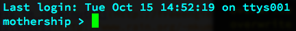

Getting started with Git [interesting]
---------------------------------------

### Why Git?

[Git](http://git-scm.com/) is a piece of software that helps you keep track of changes that you've made to your work. Have you ever worked on a complex project and ended up with a project folder that looks like this?

```
project.js
project_Old.js
project_USE_THIS_ONE.js
project_test1.js
project_test2.js
```

Would you have been able to guess that project_test1.js was actually the best one? Of course you would, because most of us have directories that look like this, and we rely on magic to make sense of them.

Git is great because it doesn't rely on magic. Instead of having a chaotic directory full of confusing file versions, you just have one:

```
project.js
```

Every time you make an important change to that file, you tell git about it by making a *commit*. A commit is a snapshot of what that file looks like at that point in time. It includes the entire file, or entire directories, that you can go back to at any time to view, change, or start working on. If you realize you prefer an earlier version of a file, you can use that as a new starting point. If you want to combine parts of early work with parts of newer work, you can do that by merging different commit states. However, you'll never lose any work that you've committed  earlier. That means you can experiment like crazy and never worry losing earlier work that worked perfectly.

Amazingly, git is extremely easy to use and understand if you stick to the basics. It can get complex, but only if you want it to. You'll only ever need to use about 5% of its features 99% of the time. You just need to know how to add files, commit them, create branches, check them out, and merge them.

And the other great thing is that it's a command-line tool. Although [there are many GUIs](http://git-scm.com/downloads/guis) that let you avoid the command-line - don't use them! They all exaggerate the complexity and hide git's inherent, zen-like simplicity. It's vastly easier to understand and use git on the command-line. If you've ever been afraid of learning to use Unix and command-line, now's the time to learn just so that you can start using git. Let's find out how.

### Learning Unix

Unix is an operating system developed in the 1960's that's still running behind the scenes on most modern computers. You can access it by opening the Terminal application from whatever computing platform you're using (OSX, Windows or Linux). Instead of controlling your computer by using mouse to click on things, with Unix you type in text commands. Before you can start using git, you need to learn some basic Unix.

You'll love it; it's a wonderfully retro-future way to scare your parents. Here are some of the best tutorials available to help get you started.

Maybe start with Michael Johnston's 2 great little videos:

<iframe width="640" height="360" src="//www.youtube.com/embed/cX9ASUE3YAQ" frameborder="0" allowfullscreen></iframe>

He makes a few small mistakes, which he corrects here:

<iframe width="640" height="360" src="//www.youtube.com/embed/INk0ATBbclc" frameborder="0" allowfullscreen></iframe>

He explains how to set Unix up on Windows here:

<iframe width="640" height="360" src="//www.youtube.com/embed/GWJT-6gOQRU" frameborder="0" allowfullscreen></iframe>

Ok, got it? Next, spend a bit of time getting used to working with Unix. You'll find these next two resources really helpful while you do:

* [Learn Unix in 10 minutes](http://freeengineer.org/learnUNIXin10minutes.html)
* [Unix cheatsheet](http://www.rain.org/~mkummel/unix.html)

Now spend a few days trying to do things in Unix that you would normally do with a GUI. Try creating files and directories, renaming them, moving files around, creating and viewing text files with cat and nano. All that stuff.  

(And don't forget: *if you have a file or directory name with spaces in it, surround that name with quotation marks to reference it using a Unix command*.)

#### Customize Unix

There are a few small customizations to Unix that are nice to set up.

* A unique command prompt.
* The default ability to view hidden directories and folders when you type "ls".

Here's how to do both these things in one go:

1. Navigate to your home directory by typing cd.
2. Use nano to create a new text file called .bashrc

```
nano .bashrc
```

3. Add the following two lines, and save the file.

```
PS1="mothership > "
alias ls="/bin/ls -aF"
```

Restart the terminal, and you'll see something like this:



Now type "ls", and you'll get a much more helpful listing of a directory's contents.


#### Install Z

Soon, you'll start to get annoyed by having to use cd to laboriously move between directories. That's when you should install a brilliant little script called [Z](https://github.com/rupa/z). It lets you jump to your most used directories by just typing something like this:

```
z project
```

That will immediately take you to your most used folder of any name, such as "project" in this example. You can even just use part of the folder name, like this:

```
z p
```

If you're new to Unix, it can be confusing to install Z. So follow these steps to get it working properly:

1. [Download Z from github](https://github.com/rupa/z)
2. cd to your home directory, and create a folder called scripts

```
cd
mkdir scripts
```

3. Copy the Z files from the download location into that new scripts folder. (You'll need to figure this out based on how your own computer's directory system is set up.)
4. Make sure you're back in your home directory by typing "cd".
5. You need a file called ".bashrc" that stores details about where to find scripts. You can create new ".bashrc" file or edit an existing one by opening it in nano:

```
nano .bashrc
```

6. Add this new line, and save the .bashrc file

```
. ~/scripts/z.sh
```

Z should now work! Cd to a few directories that you commonly use so that Z learns to recognize them. Then try navigating to them using Z.

### Installing and setting up Git 

Now that you're deep into the Unix sub-culture, you're ready to install and use git! The best instructions for installing it are from the official git documentation.

Follow these instructions:

<http://git-scm.com/book/en/Getting-Started-Installing-Git>

And then these:

<http://git-scm.com/book/en/Getting-Started-First-Time-Git-Setup>

Got it? Ok, now you can start using git. Let's imagine that you're an author who writes books about how to make video games. Maybe you want to start keeping track of changes you make to chapters. Here's what you'd need to do.

1. Cd to the directory containing the chapter file, and take a look at the directory contents by typing "ls"


There's one file in there called ch01.txt. We can view its contents with help of cat.


Wow, only one meagre sentence so far! What a lazy author. And not too encouraging either.

Anyway, we want to start keeping track of changes to this file. Initialize git inside this directory like this:

```
git init
```

As soon as you do this, git creates a *repository*. A repository is a hidden folder called ".git" that stores all the versions of your files. As soon as you type "git init", you should see a confirmation message that looks something like this:


Type "ls" again to see how this directory has changed.


You can see that it contains a new folder called ".git". (Folder names that begin with "." are known as hidden or system folders.) You can actually look inside the folder if you want to by typing "ls .git" - but don't bother! It will just confuse you and in any case you'll never need to open it - ever.

Now we need to add the files that we want git to start tracking. You can add any specific file or directory like this:

```
git add fileName.extension
```

If you want to track all the files and folders in the directory, you can do that like this:

```
git add *
```

(In Unix, a "`*`" just means "everything". Those in-the-know call them *wildcards*).

Once you've added a file you can check git's current status by typing this:

```
git status
```

In this example, it tells me that I've added a new file called ch01.txt


Do you see where it says "On branch master"? When you start tracking a project, git creates something called a *branch*. You can think of it as simply an empty drawer that git uses to store snapshots of changes to your files. The first branch of your project will always be called *master*.

### Making commits

Now we need to tell git to save the project's current state. This is called *making a commit*. Here's how to do it:

```
git commit -a -m "This is the first commit"
```

As soon as you do this, git will remember the state of this project. That means you can now go back to your file to view it at this state whenever you need to. You can type anything you like inside the quotation marks to help you remember what the state of this file was.

Here's what you'll see as soon as you make a commit


You can see that it tells you the commit was made on the master branch. Great, this state is now saved forever! We can mess up the file in any way we like, but always return to this state if we need to.

Now let's make some changes to the file using nano.

```
nano ch01.txt
```

I'm going to change the first sentence, and then save the file.


I haven't changed the file name, just the content.

Now I want to save this new state, so I'm going to do another commit

```
git commit -a -m "The second commit"
```


Git tells me that I made 1 insertion and 1 deletion. That's correct, of course. I inserted the word "easy" and deleted the word "difficult". See how git uses a minus sign to stand for deletions and a plus sign to stand for additions?

I've now made two commits. If you're curious about the commits you've made type this:

```
git log
```

Git will display all the commits you've make, like this:


But this is kind of confusing to read. So, it's better to use the following one-off customization to make logs much more readable. Copy and paste this bit of code into the command line and press enter.

<textarea>git config --global alias.lg "log --color --graph --pretty=format:'%Cred%h%Creset -%C(yellow)%d%Creset %s %Cgreen(%cr) %C(bold blue)<%an>%Creset' --abbrev-commit --"</textarea>

Don't worry about understanding it - you don't have to!

Now, type this:

```
git lg
```

It gives you a pretty, legible display of your commits.


(If you ever have to view a long list of commits like this, press "q" to quit the log output.)

If you make a commit and then realize right afterwards that you forgot something, like a file you needed to add, you can ammend the commit. Make whatever change you need to, then type this:

```
git commit --amend
```

The change will be added to the previous commit.

### Checking out an earlier version

Let's say you changed you mind. Making videogames is really, really difficult. You can check out the first version of the file like this:

```
git checkout 73667cc
```

(73667cc is git's code name for that first version of the file.)  Git now shows me this:


Don't worry about all that extra stuff about branches. (we'll get to that later!) What's cool is that you're now back to working with the old version of the file. You can confirm that by viewing its contents with cat.


Yup, the first version of the file! The filename hasn't changed, and we also haven't lost the second commit we made. It's just that now the file's state has been set to what it was at the first commit. Git is doing all this for us automatically in the background. You can make any changes you like to the file, and make as many new commits using this earlier state as a basis.

An important thing to note, however, is that we're not inside the master branch anymore. We have something called a "headless" branch. That's important, because it means we haven't lost that second commit we made. It still exists in the master branch. But to view it, we have to get back to the master branch by checking it out again.

```
git checkout master
```

Now, if you type "git lg" again, you'll see we're back in the master branch. The "HEAD" is pointing to the second commit.


Just to confirm, what does the current version of the file look like?


It's the latest version of the file. Cool, we just did a bit of time travelling, and making videogames is easy again!

For basic git use, this might be all you need to know. Even with this basic usage, it's still way, way better than the chaotic file-naming system naming that we started this article with. 

But for really creative programming, you need to know how to make and merge branches.

### Making a new branch

Often when you're working on a programming project, you'll get everything working perfectly, but then want to add a few extra new features. However, you're scared to add those new features because you might make some tiny, hard to track-down mistake that makes the entire thing stop working. Git was made to solve this kind of problem, and it's the main reason why it's so helpful to programmers. When you want to start experimenting, *create a new branch*.

When you initialize a git project, the first branch that git creates is called *master*. You can think of the *master* branch as containing the most stable version of your project. Everything works. You should create a new branch, called *develop* that you use to do all you experimental programming. You can make any changes to the *develop* branch and know that whatever you do won't ruin the stable *master* branch. You can always go back to the *master* at any time if you've made a big mistake that you can't fix. But, when you solve all the problems and add all the new features in the *develop* branch, you can merge the *develop* branch with the *master* branch.

Let's see how this works in our current example. Remember that we've currently got two commits


Now I want to start experimenting. I'm going to checkout the latest version of the file, and use it to create a new branch called develop

```
git checkout -b develop 
```


Type "git lg" to see what's going on


This tells us that we have two branches, master and develop, and that they're both pointing to the same commit: "The second commit"

We can confirm that we're on the new develop branch like this:

```
git branch -v 
```


The "branch -v" command shows us the branches we have in our project. The currently active branch, develop, has a star next to it.

That's exactly what we want. We're now ready to go off the deep end! We can make any experimental changes we like in the develop branch, and the master will be unaffected. When we're happy with the results, we can merge it with the master branch. Let's see how this works.

First I'm going to make change to the file, save it, and commit it.


Now I'm pretty happy with that. In fact, I like it so much, I want to incorporate the changes into the master branch. To do that, first checkout the master.

```
git checkout master
```


Next, merge it with the develop branch.

```
git merge develop
```


Now if you check the log again ("git lg") you'll see this:


You're now back in the master branch, and the work you did in the develop branch has been merged into it.

The develop branch is still there, so you can check it out again and continue doing more experimental work, with as many commits as you like, until you're ready to merge it back into the master again.

The git documentation has an excellent article on [typical workflow using branches](http://git-scm.com/book/en/Git-Branching-Branching-Workflows) that you definitely should read.

### Creating version number tags

If your project has reached an important milestone, you can give it a version number. Git calls these version numbers *tags*. Let's say your master branch is working perfectly and you want to give it a version number like this:

v1.0

Make sure that the master branch is checked out, and type this:

```
git tag -a v1.0 -m "version 1.0"
```

Check the log again, and you'll see that your version number has been added to the current commit.


If you want to see a specific version number in your project, you do it like this:

```
git show v1.0
```

Then, if you like, you can use it to start a new development branch, which could be parallel to the others, and then later possibly merge with them. Git is extremely flexible like that.

If you're new to software version numbering standards, you can read all about how to do it [here](http://semver.org/).

### A few more things you should know

And that's about all you really need to know to get started using git in your own work. The best thing to do now is to try it out in your next project; you'll soon discover that it's indispensable.

But you'll also have many more questions and probably want to try out more advanced features. The best overall place to look is the excellent git documentation.

<http://git-scm.com/book>

Here are few things to keep in mind while you're working with git:

* You can move or rename any file or folder and git will keep track of it. Just type:

```
git mv fileName newFileName
```

This works the same as the Unix "mv" command, except that informs git of the name or location change.

* Remove a file from the directory, and from git tracking like this: 

```
git rm fileName
```

* If you're working on a complex project, especially with more than one contributor, you might run into *merge conflicts*. If you do, type "git mergetool". This opens up a GUI that walks you through each conflict and lets you choose how discrepancies should be merged.
* It's not just text files, you can use git to version-track binary files, like images and sounds. Git handles binary file tracking extremely well, so it's great for multimedia projects. 
* Git has a built-in GUI that can show you differences between commits. type "gitk" on the command line to play around with it.
* You might want to share a project or collaborate on one with others. This is where things get really interesting! The best place to start is [GitHub](https://github.com). Create an account, read the tutorials, and try pushing one of your git repositories to it. It's a great way to share your work with the rest of the world.

Have fun!

### A Git cheat-sheet

Here are all the basics you need to know. For more detail check out [Git in 5 Minutes](http://classic.scottr.org/presentations/git-in-5-minutes/)

```
Check settings:
git config --list

Check username:
git config user.name

find help:
git help <verb>

To initialize a repository,
browse to the folder, then type:
git init

Start version controlling all existing files:
git add *
git commit -m "initial project version"

Add a single file or directory:
git add fileOrFolderName

Clone an existing respository:
clone git://github.com/schacon/grit.git folderName

Check the status of your files:
git status

Commit changes (which skips an optional staging area):
git commit -a -m "added new benchmarks"

Remove a file:
git rm fileName

View commit history:
git log

View changes made in the last commits 
(-2 means view last two changes):
git log -p -2

View changes showing branch and merge graph:
git log --pretty=format:"%h %s" --graph

Make an alias for really nice log output:
git config --global alias.lg "log --color --graph 
--pretty=format:'%Cred%h%Creset -%C(yellow)%d%Creset 
%s %Cgreen(%cr) %C(bold blue)<%an>%Creset' 
--abbrev-commit --"

Use the new alias above like this:
git lg

View remote repositories:
git remote

Update a repository from a remote location:
git fetch origin

Push a project to remote location:
git push origin master

Create a version number:
git tag -a v0.1 -m 'version 0.1'

Show a version number:
git show v0.1

Create a new branch:
git branch develop

Switch to the new branch:
git checkout develop

Move back to the master branch:
(after committing the new branch):
git checkout master

To make a branch and check it out at the same time:
git checkout -b develop 

To merge a branch to the master 
(after committing the new branch):
git checkout master
git merge develop

Delete a branch you no longer need:
git branch -d develop

How to solve merge conflicts:
git mergetool

View branches: 
(A star indicate the branch that 
is currently checked out)
git branch -v

See which branches you've merged:
git branch --merged

See which branches you haven't merged:
git branch --no-merged

Rebase is another style of merging that cleans 
up the commit history:
git checkout experiment
git rebase master
http://git-scm.com/book/en/Git-Branching-Rebasing

View currently tracked files:
git ls-tree -r develop --name-only

Remove a file from the file system and tracking:
git rm file.txt
```